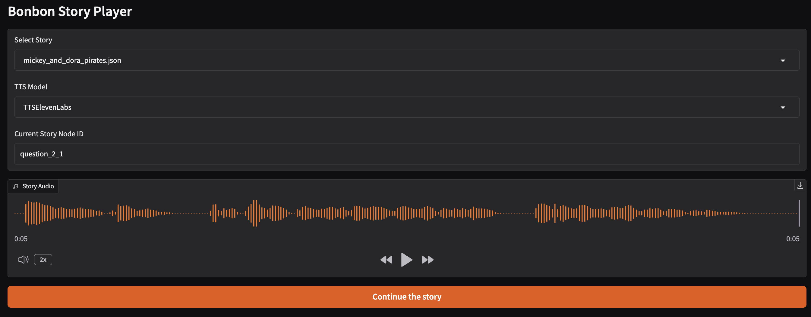

# Bonbon

Bonbon is an educational platform that creates interactive stories for children, leveraging AI to provide engaging and adaptive learning experiences.

## Overview

The platform consists of several key components:

- **Story Player App**: A Gradio-based web interface that allows children to interact with stories through speech
- **Text-to-Speech Library**: Uses Coqui TTS to convert story text into natural-sounding speech
- **Speech-to-Text Library**: Employs Wav2Vec2 for accurate transcription of children's responses
- **Story Graph Library**: Manages the flow and branching of interactive stories based on user responses

## Installation
### Install uv package manager and graphviz:

MacOS:
```bash
brew install uv
brew install graphviz
```

Ubuntu:
```bash
sudo apt install uv
sudo apt install graphviz
```

uv allows you to install each library. Example for lib-text-to-speech:
```bash
cd libs/bb-lib-text-to-speech
uv sync --reinstall
```


## App Story Player

```bash
cd services/story-player-app
uv run python app_story_player.py
```

This will start the Gradio web interface at `http://localhost:7860`. That allows you to play the story and interact with it.

## Environment Variables
You will need to set the following environment variables:
- `BONBON_WORKSPACE`: The path to the Bonbon workspace
- `BONBON_WORKSPACE_DATA`: The path to the Bonbon workspace data. This is where the story files are stored.

### API Keys

- `ELEVENLABS_API_KEY`: The API key for the ElevenLabs text-to-speech service
- `MISTRAL_API_KEY`: The API key for the Mistral AI speech-to-text service

You can set them in your `.zshrc` file:
```bash
export ELEVENLABS_API_KEY="your_elevenlabs_api_key"
export MISTRAL_API_KEY="your_mistral_api_key"
```

## Apps
[Readme: Story Creator App](services/story-creator-app/README.md) : This app allows you to generate a story.


--- 
[Readme: Story Graph App](services/story-graph-app/README.md) : This app allows you to generate questions and create a story graph.


Plot of the story graph:


---
[Readme: Story Player App](services/story-player-app/README.md) : This app allows you to play the story and interact with it.




